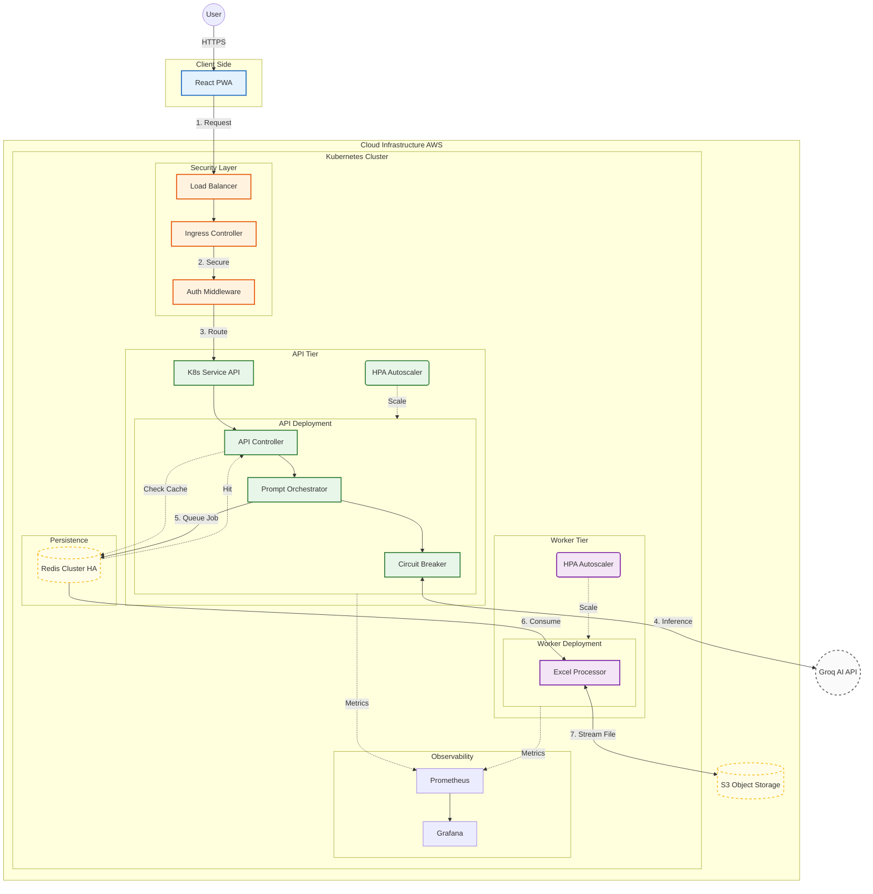

# SheetPilot System Architecture

## Architectural Diagram

---

## 1. Visual Architecture (The "Blocks and Arrows")

### Option A: Logic Flow (Mental Model)
*Here is the text-based version of the arrows if you cannot render the graph:*

`[ User ]` --> types "Highlight rows > 5000" --> `[ Frontend (React) ]`
`[ Frontend ]` --> sends Command + Visible Columns --> `[ Backend API ]`
`[ Backend API ]` --> `[ AI Service ]` --> `[ Prompt Orchestrator ]`
`[ Prompt Orchestrator ]` --> `[ LangChain Adapter ]` --> `[ Groq (Llama-3) ]`
`[ Groq ]` --> returns JSON --> `[ Zod Schema Validator ]`
`[ Zod Validator ]` --> (if valid) --> `[ Excel Engine ]`
`[ Excel Engine ]` --> executes logic (using `exceljs` / `mathjs`)
`[ Excel Engine ]` --> returns Updated Data --> `[ Frontend ]`
`[ Frontend ]` --> re-renders ONLY visible cells (Virtualization)

---

## 2. "Truth vs. Hype" (How to Explain It)

| Component Name | Real Implementation (Code) | "System Architect" Explanation (Hype) |
| :--- | :--- | :--- |
| **Virtual Grid Engine** | `Spreadsheet.jsx` | Handles the complexity of loading only visible rows. |
| **Prompt Orchestrator** | `promptOrchestrator.js` | Builds the system prompt and manages context. |
| **Schema Guard** | `aiService.js` | The Zod schema validation that prevents errors. |
| **LangChain Adapter** | `promptOrchestrator.js` | The `ChatGroq` class we instantiate. |
| **Excel Service** | `excelService.js` | Handles `ExcelJS` operations. |
| **Ingress Controller** | *Infrastructure* | The "Front Door" (Load Balancer, SSL, Auth). |
| **Observability Stack** | *Infrastructure* | Prometheus (Metrics) & Grafana (Dashboards) to monitor pod health. |
| **Redis Cluster (HA)** | *Infrastructure* | **High Availability** cache/queue. Clustered to prevent Single Point of Failure. |
| **Worker Deployment** | *Infrastructure* | Separate pods for Excel processing to prevent CPU bottlenecks on the API. |
| **Circuit Breaker** | *Logic Pattern* | Prevents cascading failures if Groq API goes down (Timeout/Retry logic). |
| **S3 Storage** | *Infrastructure* | Replaces local disk for durable, scalable file storage. |

---

## 4. "Expert Level" Interview Questions & Answers

### Q1: "Why did you separate the Excel Worker from the API?"
> **Answer:** "Excel processing is CPU-intensive. If I kept it in the API pod, a large file calculation could block the Node.js event loop, causing timeouts for other users. By moving it to a separate **Worker Deployment** consuming from a **Redis Queue**, I can scale the workers independently based on CPU load (HPA) without over-provisioning the API servers."

### Q2: "How do you handle a Groq API failure?"
> **Answer:** "I implemented a **Circuit Breaker** pattern. If the AI service times out or returns 5xx errors, the circuit 'opens' and we immediately return a fallback response (or queue the job for retry) instead of hanging the thread. This prevents cascading failures."

### Q3: "How do you secure this architecture?"
> **Answer:** "Security starts at the **Ingress Layer** with SSL termination and Rate Limiting to prevent abuse. We use an **Auth Middleware** (JWT verification) before the request even reaches the business logic. Inside the cluster, we use **Kubernetes Secrets** to manage API keys, ensuring they are never checked into code."

### Q4: "How does this scale?"
> **Answer:** "We use **Horizontal Pod Autoscalers (HPA)**.
> *   The **API Tier** scales on Memory usage (since it holds request contexts).
> *   The **Worker Tier** scales on CPU usage (for Excel math) or Queue Depth (lag).
> *   Redis is deployed in **Cluster Mode** for High Availability."
